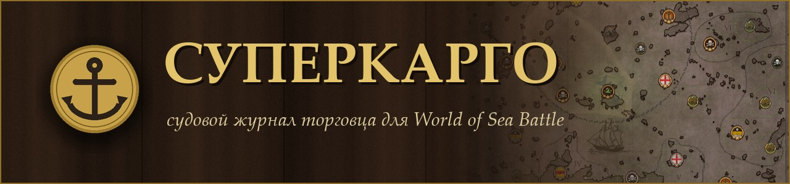
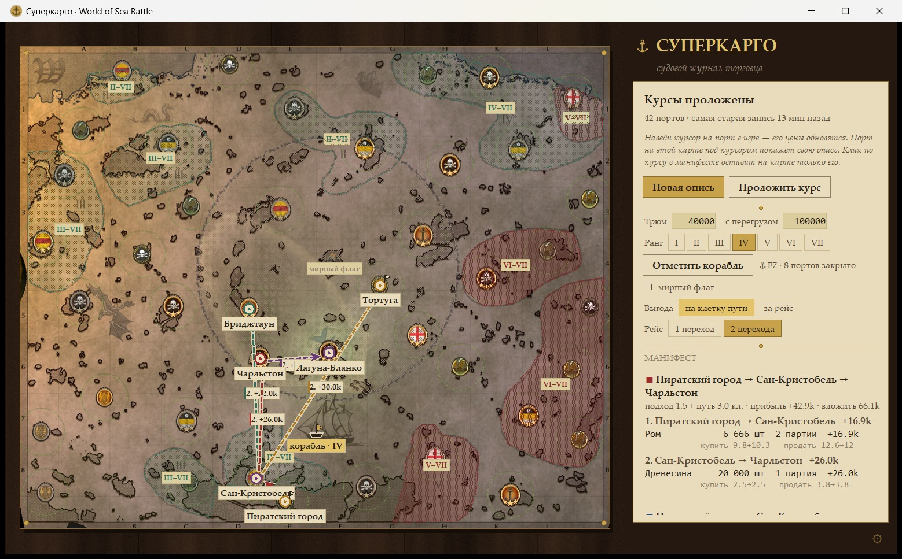
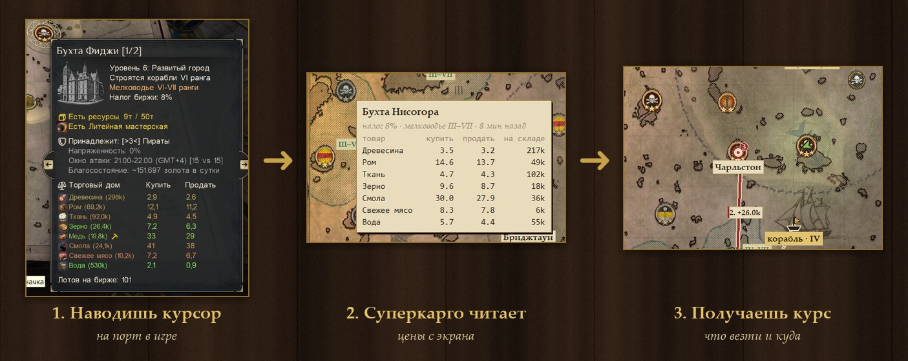
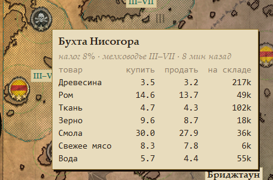
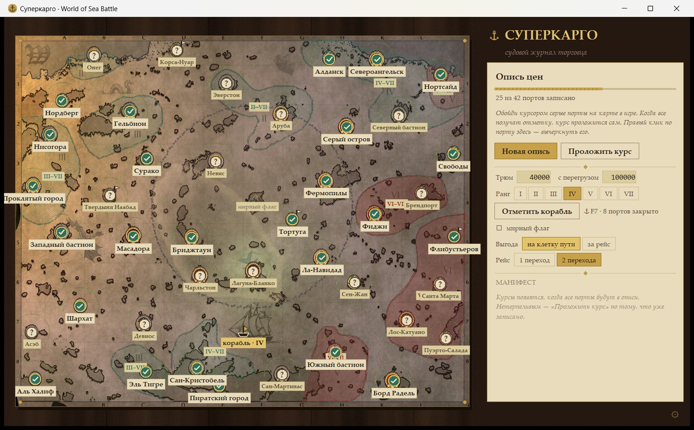

  

  <b>Подсказывает, что купить, куда везти и сколько заработаешь.</b> 
  Ты просто водишь курсором по портам на карте — остальное он посчитает сам.

  
  
  
  

---

  

## Как это работает

  

Открываешь карту мира в игре и по очереди задерживаешь курсор на портах. Суперкарго замечает всплывшую подсказку, читает с неё цены и тихонько звякает — порт записан. Когда обойдёшь все, он сам проложит лучшие курсы.

## Что он умеет

| | |
|---|---|
| 🧭 **Прокладывает курс** | Лучшие рейсы на карте, в один или два перехода: купил в A, продал в B, там же закупился и повёз в C. |
| ⚖️ **Считает по-честному** | Учитывает вес товаров, трюм и то, что цена ползёт после каждой купленной партии. Никаких «+500% на воде». |
| 🌊 **Знает мелководье** | Выбираешь ранг своего корабля — курсы огибают мели, куда тебе не пройти, а недоступные порты выпадают из расчёта. |
| 🏳️ **Мирный флаг** | Одна галочка — и маршрут обходит центральный круг и порты, закрытые под мирным флагом. |
| ⚓ **Помнит, где ты** | Отмечаешь свой корабль на карте — и в расчёт идёт ещё и путь до первого порта. |
| 📜 **Опись всегда под рукой** | Наведи мышку на любой порт в журнале — увидишь все его цены и сколько им минут. |

  
  &nbsp;
  

## 🛡️ Это не чит

Суперкарго видит **ровно то же, что и ты**: он делает скриншот окна, как OBS или Discord во время стрима, и читает с него текст подсказки.

- ❌ не лезет в память игры и не трогает её файлы
- ❌ не перехватывает сетевой трафик
- ❌ не нажимает кнопки и не двигает мышь за тебя
- ✅ только смотрит на экран и считает

Поэтому античиту просто не на что реагировать: для него это обычная программа захвата экрана, как OBS. Торговать, выбирать и плыть — всё равно тебе.

## Установка

Ничего ставить не нужно — ни Python, ни библиотек.

1. Скачай архив **`Supercargo-…zip`** со страницы **[Releases](https://github.com/GrafEnters/wosb-supercargo/releases/latest)**.
2. Распакуй куда удобно.
3. Запускай **`Supercargo.exe`**. Готово!

> Русский язык для распознавания текста уже встроен в Windows, отдельно ничего качать не нужно.

<b>Из исходников</b> — для тех, кто хочет покопаться в коде

 

1. Поставь **[Python 3.13](https://www.python.org/downloads/)** с галочкой **«Add python.exe to PATH»**.
2. **Code → Download ZIP**, распакуй и запусти **`install.bat`** — он поставит библиотеки и сделает ярлык «Суперкарго».
3. Собрать свой `.exe`: `.venv\Scripts\python -m pip install pyinstaller`, потом `.venv\Scripts\python build.py`.

## Первый рейс

1. Запусти игру и Суперкарго.
2. В журнале выбери **ранг своего корабля** и нажми **«Отметить корабль»** → клик по карте там, где ты стоишь.
3. В игре открой карту мира и задерживай курсор на портах — каждый записанный получает зелёную галочку.
4. Когда все порты в описи, курсы проложатся сами. Клик по курсу в манифесте оставит на карте только его.
5. Цены в игре меняются — нажми **«Новая опись»** и пройдись по портам ещё раз.

<b>Частые вопросы</b>

 

**Порт не записывается.** Подержи курсор на порту чуть дольше, пока подсказка полностью не проявится, и не закрывай её мышкой. Если подсказку закрывает другая всплывашка игры, сдвинь курсор на пару пикселей.

**Прибыль кажется странной.** Цена в игре меняется после каждой партии; Суперкарго знает средний шаг для каждого товара, но не точный. Цифры — хороший ориентир, а не обещание.

**Игра в другом разрешении.** Проверено на 1920×1080. В другом разрешении Суперкарго переключится на запасной способ поиска подсказки — он медленнее, но должен справиться. Если нет — напиши мне.

**Windows пишет «Система Windows защитила ваш компьютер».** Так SmartScreen встречает любую программу без платной цифровой подписи. Нажми **«Подробнее» → «Выполнить в любом случае»**. Весь код открыт здесь же, можно проверить.

**Где мои данные.** В папке `data` рядом с программой. Удалишь её — Суперкарго начнёт с чистого журнала. Новую версию можно распаковать поверх старой: журнал сохранится.

## Будем знакомы

Сделано с любовью к морю одним капитаном для всех остальных. 🏴‍☠️

- 💬 Любые вопросы, идеи и найденные баги — пиши в Telegram: **[@Graf_Enters](https://t.me/Graf_Enters)**
- 🤝 Добавляйся в друзья в игре: ник **GrafEnters**, гильдия **[ZGS]**

Код открыт под [лицензией MIT](LICENSE): бери, меняй, делись.

<i>Попутного ветра и полных трюмов!</i> ⚓

